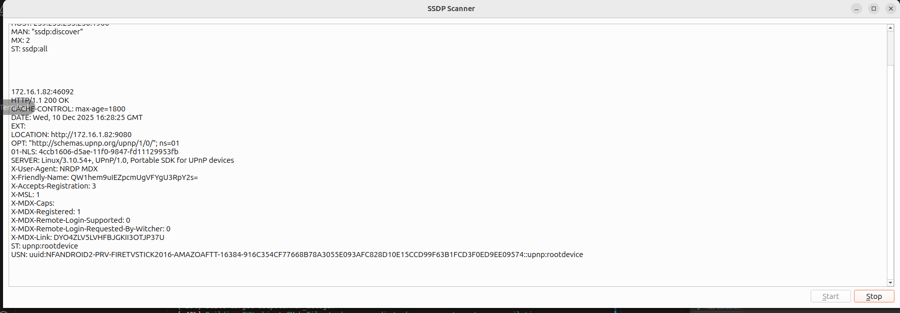

## SSDP-Scanner ##

Scans for SSDP servers using the multicast msearch address of 239.255.255.250.
Original goal of this application was to use SSDP and ECP to control a roku as per:
https://developer.roku.com/en-ca/docs/developer-program/dev-tools/external-control-api.md
Though other products use SSDP as well further investigation on how to use this should eventually be done.

There is also a Samsung Remote ip here done in python:
https://pypi.org/project/samsungctl/

One can scan for ports using nmap as below:
```
davidtu@calysto:~/work/ssdp-scanner$ nmap -Pn -p 1-65535 172.16.1.74
Starting Nmap 7.94SVN ( https://nmap.org ) at 2025-07-09 15:54 CST
Nmap scan report for 172.16.1.74
Host is up (0.024s latency).
...
```
On my samsung I noticed that:
Port 7678 has a sort of API service on 172.168.1.74:7678/nsservice
This is advertised when queries are made to 239.255.255.250:1900.
The Samsung TV IP will see these queries and send an SSDP protocol response as part of an ssdp:discover message  to be the actual http urn port that is used for nsservice as part of upnp as it is replied to queries sent to 239.255.255.250:1900 to the source port.

### Build Instructions

On Ubuntu I have QT installed in this directory
/opt/Qt
and can just run the build.sh script from the directory that contains the source doing
./build.sh

This could be improved to remove the buildDirectory on clean.

### How to Run

Simply call 
```
./buildDir/ssdpscanner
```
It should startup an app that looks as such:


When the Start button is pressed MCAST packets are sent out on a multicast port which devices on the network can respond to.  Multiple responses from different IPs are not redisplayed.  In example, above the IP I see appears to be an older linux kernel of 3 for an older amazon firestick.

### How many threads does it use

Looking at GDB it seems to be using
```
gdb) info threads
  Id   Target Id                                             Frame 
* 1    Thread 0x72cab6a14900 (LWP 2699718) "ssdpscanner"     0x000072cab691b4fd in __GI___poll (fds=0x5b7809964d70, nfds=5, timeout=-1) at ../sysdeps/unix/sysv/linux/poll.c:29
  2    Thread 0x72caa89fc6c0 (LWP 2699725) "ssdpscanner"     syscall () at ../sysdeps/unix/sysv/linux/x86_64/syscall.S:38
  3    Thread 0x72caa91fd6c0 (LWP 2699723) "gdbus"           0x000072cab691b4fd in __GI___poll (fds=0x72ca9c000b90, nfds=2, timeout=-1) at ../sysdeps/unix/sysv/linux/poll.c:29
  4    Thread 0x72caa99fe6c0 (LWP 2699722) "gmain"           0x000072cab691b4fd in __GI___poll (fds=0x5b78093fbc30, nfds=1, timeout=-1) at ../sysdeps/unix/sysv/linux/poll.c:29
  5    Thread 0x72caaa1ff6c0 (LWP 2699721) "pool-spawner"    syscall () at ../sysdeps/unix/sysv/linux/x86_64/syscall.S:38
  6    Thread 0x72cab21fe6c0 (LWP 2699720) "QXcbEventQueue"  0x000072cab691b4fd in __GI___poll (fds=0x72cab21fdb38, nfds=1, timeout=-1) at ../sysdeps/unix/sysv/linux/poll.c:29
  7    Thread 0x72cab29ff6c0 (LWP 2699719) "QDBusConnection" 0x000072cab691b4fd in __GI___poll (fds=0x5b780945b9c0, nfds=4, timeout=-1) at ../sysdeps/unix/sysv/linux/poll.c:29
(gdb) quit
```

Thread 7 handles processEvents which would be where slots are processed and any event activity:
```
#2  0x000072cab6b13a63 in g_main_context_iteration () at /lib/x86_64-linux-gnu/libglib-2.0.so.0
#3  0x000072cab7474c6e in QEventDispatcherGlib::processEvents(QFlags<QEventLoop::ProcessEventsFlag>) () at /opt/Qt/6.9.1/gcc_64/lib/libQt6Core.so.6
#4  0x000072cab719103b in QEventLoop::exec(QFlags<QEventLoop::ProcessEventsFlag>) () at /opt/Qt/6.9.1/gcc_64/lib/libQt6Core.so.6
#5  0x000072cab729d95e in QThread::exec() () at /opt/Qt/6.9.1/gcc_64/lib/libQt6Core.so.6
```
This appears to only occur when using gdb.  Doing:
```
cat /proc/2707231/task/*/status | grep Name
Name:	ssdpscanner
Name:	QXcbEventQueue
Name:	QDBusConnection
```

I see three threads which is more reasonable.


### Todo: ###
- Investigate using an SSDP C library to simplify this code (QtUPNP is a CFramework which probably makes this redundant)
- Add unit tests - not well tested
- Add functionality for search
- Identify what device was found by querying location data.
